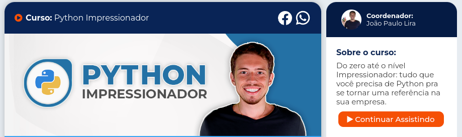

# Curso de Python Impressionador da Hashtag Treinamentos

## Objetivo do curso é sair do Zero até o Python Impressionador!!! 
### Curso em andamento! 

 

1. [x]  Introdução (Assista antes de começar)
2.  [x] Instalação
3.  [x] Lógica de Programação - Nunca programou Comece aqui
4. [x] Seus primeiros programas em Python
5. [x] Mais sobre Variáveis
6. [x] If - Condições em Python
7. [x] Strings - Textos e a importância no Python
8. [x] Listas Python - Métodos e Usos
9. [x] For - Estrutura de Repetição
10. [x] While e Criando um Loop infinito
11. [x] Tuplas - Uma "lista" muito útil e imutável
12. [x] Dicionários em Python
13. [x] Iterables
14. [x] Criando suas funções em Python
15.  [x] Módulos, Bibliotecas e Introdução à Orientação a Objeto
16. [x] Exercícios e O que falta aprender agora?
17. [x]List Comprehension
18. Functions usadas como parâmetro e Expressões Lambda
19. Análise da Dados com o Pandas + Integração Python e Excel
20. Como ler documentações
21. Integração Python com Arquivos txt e PDF
22. Integração Python - Arquivos e Pastas do Computador
23. Integração Python - E-mail
24. Integração Python - SQL
25. Integração Python - Automação Web (Web-Scraping com Selenium)
26. Web-Scraping com BeautifulSoup BS4
27. Regex- Expressões Regulares
28. Integração Python com APIs e JSON
29. Integração Python para Finanças
30. Ambientes Virtuais (Importante para os próximos Módulos)
31. Integração Python com ArcGIS
32. Python e Dashboards - Dash + Python e Power BI
33. Transformando Python em exe
34. Projeto 1 - Automações de Processo - Aplicação de Mercado de Trabalho
35. Projeto 2 - Automação Web - Aplicação de Mercado de Trabalho
36. Projeto 3 - Ciência de Dados - Aplicação de Mercado de Trabalho
37. Orientação a Objetos Completo - Classes e Métodos
38. Projeto 4 - Construindo um Site Completo do Zero com Flask
39. Criação de Sites com Django - Criando uma cópia do Netflix
40. Interface Gráfica - Tkinter e Criando Sistemas com Python
41. Criação de Aplicativo para Celular com Kivy
42. Criação de Jogos
43. GitHub para Organização dos Projetos
44. RPA com Python - Automações de Processos
45. Introdução a Reconhecimento de Imagem e Fala
46. Outras ferramentas auxiliares
47. Aulas Auxiliares de Front-end
48. Intensivão de Python (1ª edição - Aulas Diferentes do Intensivão Atual)
49. Semana do Python (Evento que fizemos antes do Intensivão de Python - Conteúdo Parecido)
50. Intensivão de Python (Versão Atual)
51. Gravações - Aulas Tira Dúvidas

